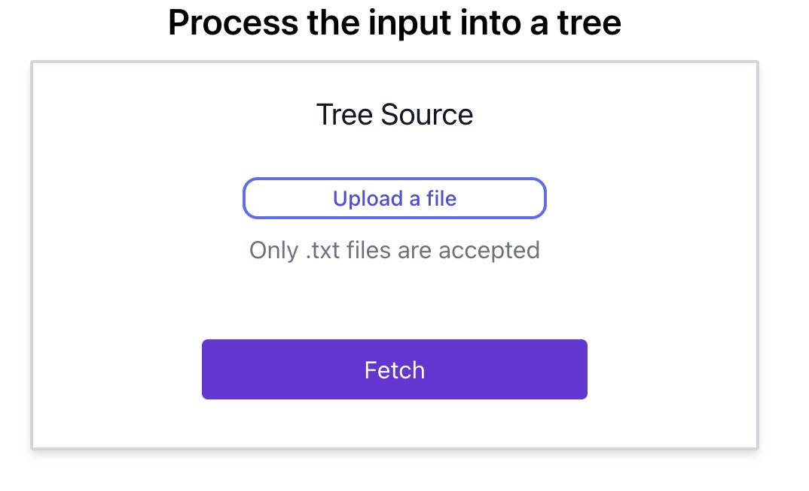
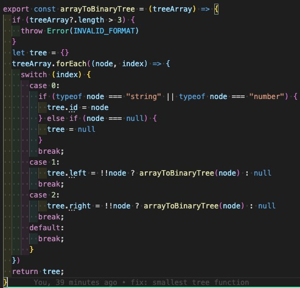
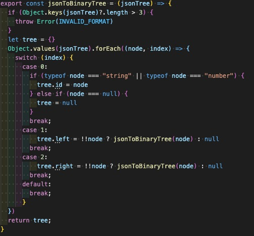
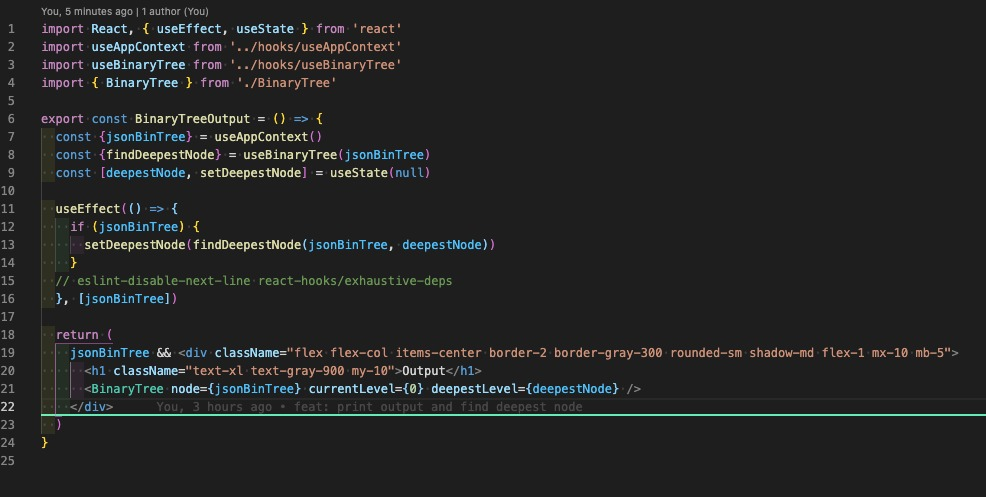
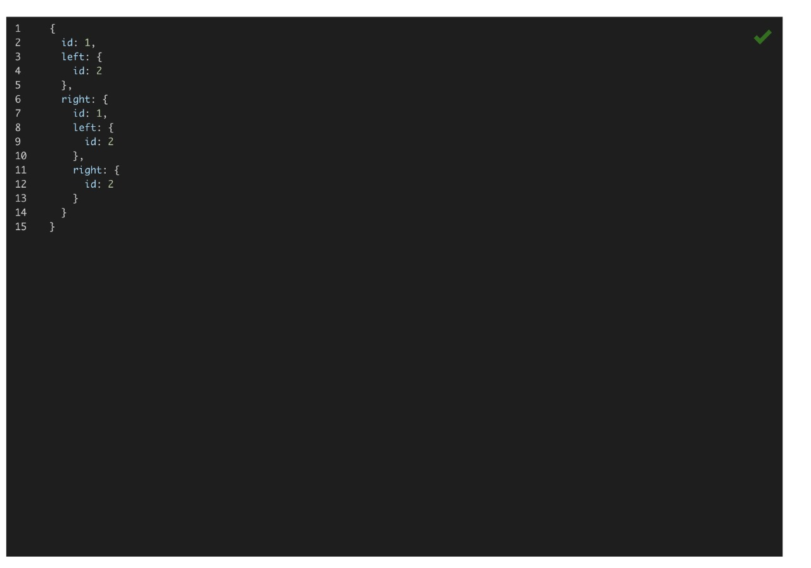
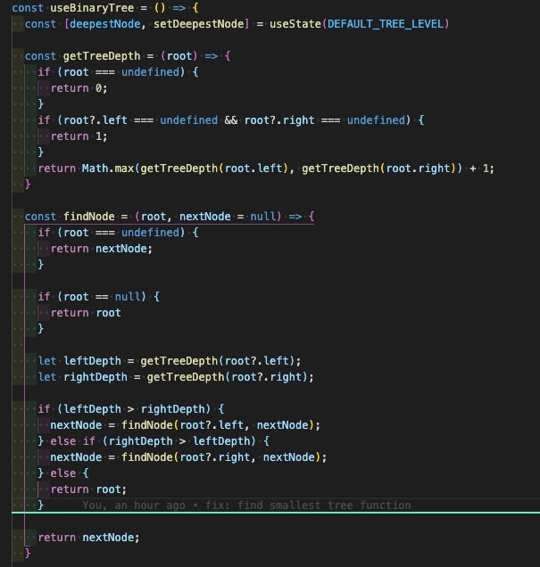
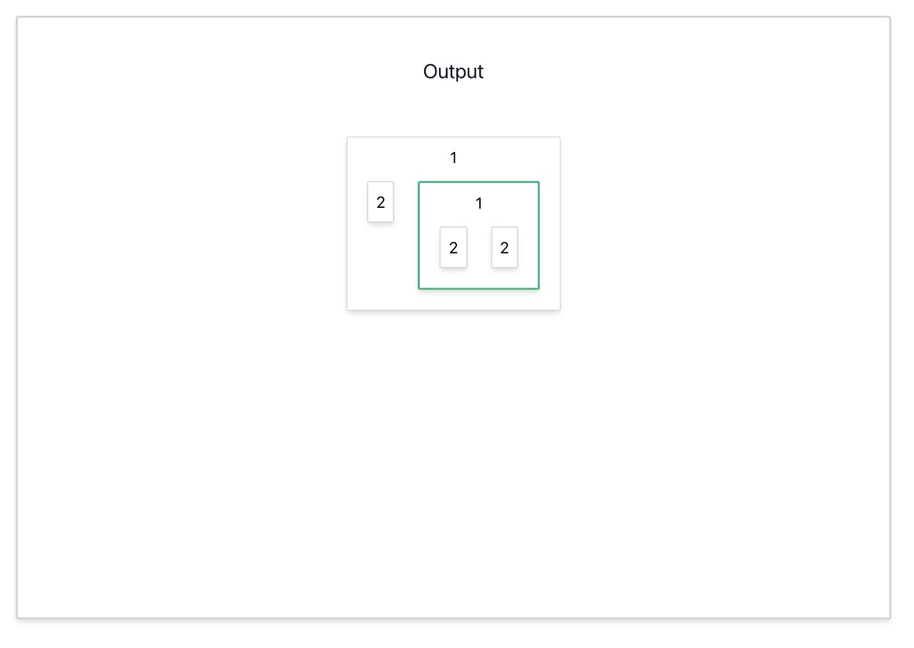

# Technical application for Microsoft

## Problem 1

The Problem 1 of the tech test is implemented in `src/utils/binaryTreeUtils.js`

In this file there are 2 methods: `arrayToBinaryTree` and `jsonToBinaryTree`

### arrayToBinaryTree
Converst the array that is read from the file input to a Binary Tree to be displayed in the TextArea below it.

### jsonToBinaryTree
Converst the textarea's json input to a Binary Tree to update the Output section.

## Problem 2

### Style

For the Web Application style, the chosen library was [tailwindcss](https://tailwindcss.com/docs) 
because of it's variaty of customization options and great performance optimization.

### File Input
To keep the implementation as simple as possible, the file input allows only `.txt` files because it's content can easily be read as a string.

### JSON text input
Instead of the textarea html element, the chosen component as the [JSON Input](https://www.npmjs.com/package/react-json-editor-ajrm) because it's easy to use and has been maintained recently. It also displays json errors by itselft.

> There are no special steps for running Problems 2 and 3, only the steps described in the Tech Challenge description.

## Problem 3

For problem 3, the `findNode` function goes through each node of the binary tree and verifies it's children to check which is the deepest node, and then returns the smallest subtree with the deepest nodes.

`/src/hooks/useBinaryTree.js`:

## Extra functions

The `findMaxDepth` was used to calculate the minimum height to be set in the JSON Input.
## Running the project

In the project directory, you can run:

### `yarn start`

Runs the app in the development mode.\

The page will reload if you make edits.\
You will also see any lint errors in the console.

### `yarn test`

Launches the test runner in the interactive watch mode.\

